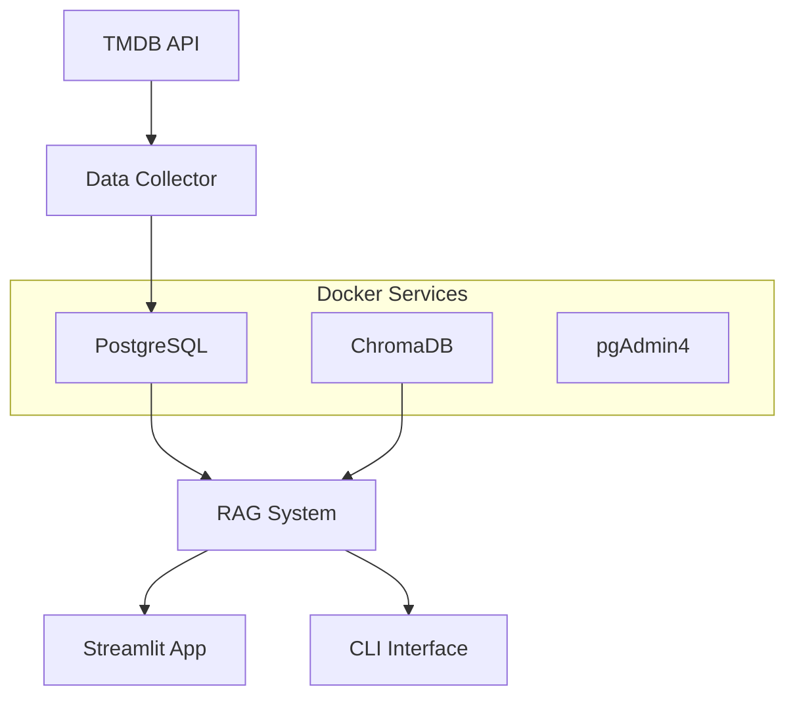

# 🎬 Movie RAG System

An AI-powered movie recommendation system using **RAG (Retrieval-Augmented Generation)** with PostgreSQL database and ChromaDB vector storage.

## ✨ Features

- 🎯 **Intelligent Movie Recommendations** using RAG technology
- 🗃️ **PostgreSQL Database** for structured movie data storage
- 🧠 **ChromaDB Vector Database** for semantic search and similarity matching
- 🌐 **Streamlit Web Interface** for interactive movie discovery
- 🐳 **Docker Integration** for easy deployment and scalability
- 📊 **Real-time Analytics** and movie statistics
- 🎨 **Modern UI/UX** with responsive design

## 🚀 Quick Start

### Prerequisites

- Python 3.10+
- Docker & Docker Compose
- OpenAI API Key
- TMDB API Key

### 1. Installation

```bash
# Clone the repository
git clone https://github.com/yourusername/movie-rag-system.git
cd movie-rag-system

# Install dependencies
uv sync
# or
pip install -e .
```

### 2. Environment Setup

Create a `.env` file:

```bash
# TMDB API (https://www.themoviedb.org/settings/api)
API_KEY=your_tmdb_api_key_here

# OpenAI API (https://platform.openai.com/account/api-keys)
OPENAI_API_KEY=your_openai_api_key_here

# Database Configuration (defaults shown)
POSTGRES_HOST=localhost
POSTGRES_PORT=5433
POSTGRES_USER=postgres
POSTGRES_PASSWORD=movie_rag_password
POSTGRES_DB=movie_rag_db

# ChromaDB Configuration (defaults shown)
CHROMA_HOST=localhost
CHROMA_PORT=8000
```

### 3. Start Services

```bash
# Start PostgreSQL and ChromaDB
docker-compose up -d

# Collect movie data (first time only)
uv run scripts/movie_data_collector.py

# Set up database (first time only)
uv run scripts/postgres_setup.py
```

### 4. Run the Application

```bash
# Command line interface
uv run main.py

# Web interface
uv run run_streamlit.py
# or
python run_streamlit.py
```

## 📁 Project Structure

```
movie-rag-system/
├── src/movie_rag/           # Main application package
│   ├── core/                # Core RAG functionality
│   │   ├── movie_rag_enhanced.py  # Enhanced RAG system
│   │   └── movie_rag.py           # Basic RAG system
│   ├── models/              # Database models and schemas
│   │   └── database.py      # SQLAlchemy models
│   ├── data/                # Data collection and processing
│   │   └── movie_data_collector.py # TMDB data collector
│   ├── services/            # Business logic services
│   ├── utils/               # Utility functions
│   └── app.py              # Streamlit web interface
├── tests/                   # Test suite
│   ├── test_integration.py  # Integration tests
│   ├── test_docker_chromadb.py # ChromaDB tests
│   └── test_postgres_rag.py # PostgreSQL tests
├── scripts/                 # Setup and utility scripts
│   ├── postgres_setup.py    # Database setup
│   └── setup_database.py    # Database initialization
├── docs/                    # Documentation
│   ├── POSTGRES_SETUP.md    # Database setup guide
│   └── setup_instructions.md # Detailed setup instructions
├── data/                    # Data files (gitignored)
│   └── movies_dataset.json  # Collected movie data
├── docker-compose.yml       # Docker services configuration
├── main.py                  # CLI entry point
├── run_streamlit.py         # Web app entry point
└── pyproject.toml          # Project configuration
```

## 🔧 Architecture



### Components

- **Data Collection**: Automated TMDB API data fetching
- **PostgreSQL**: Structured data storage with relationships
- **ChromaDB**: Vector embeddings for semantic search
- **RAG Engine**: LangChain-powered recommendation system
- **Web Interface**: Interactive Streamlit application

## 🛠️ Development

### Running Tests

```bash
# Run all tests
uv run -m pytest tests/

# Run specific test
uv run tests/test_integration.py

# Test Docker services
uv run tests/test_docker_chromadb.py
```

### Code Quality

```bash
# Format code
black src/ tests/

# Sort imports
isort src/ tests/

# Lint code
flake8 src/ tests/

# Type checking
mypy src/
```

### Adding New Features

1. Create feature branch: `git checkout -b feature/new-feature`
2. Add code in appropriate `src/movie_rag/` subdirectory
3. Add tests in `tests/`
4. Update documentation
5. Submit pull request

## 🐳 Docker Services

### PostgreSQL
- **Container**: `movie_rag_postgres`
- **Port**: `5433:5432`
- **Database**: `movie_rag_db`
- **Username**: `postgres`

### ChromaDB
- **Container**: `movie_rag_chromadb`
- **Port**: `8000:8000`
- **Persistence**: Enabled via Docker volume

### pgAdmin4
- **Container**: `movie_rag_pgadmin`
- **Port**: `5050:80`
- **Email**: `admin@admin.com`
- **Password**: `admin`

## 📊 Usage Examples

### CLI Usage

```python
from movie_rag import EnhancedMovieRAGSystem

# Initialize system
rag = EnhancedMovieRAGSystem()

# Get recommendations
recommendations = rag.get_recommendations(
    "I want a sci-fi movie with time travel"
)

# Analyze movie trends
stats = rag.get_database_stats()
print(f"Total movies: {stats['total_movies']}")
```

### API Usage

```python
# Direct database queries
from movie_rag.models.database import DatabaseManager

db = DatabaseManager()
top_movies = db.get_top_rated_movies(limit=10)
```

## 🔍 Troubleshooting

### Common Issues

1. **ChromaDB Connection Failed**
   ```bash
   docker-compose restart chromadb
   uv run tests/test_docker_chromadb.py
   ```

2. **PostgreSQL Connection Issues**
   ```bash
   docker-compose logs postgres
   uv run tests/test_integration.py
   ```

3. **Missing OpenAI API Key**
   ```bash
   echo "OPENAI_API_KEY=your_key_here" >> .env
   ```

### Performance Optimization

- Use Docker volume mounts for persistent data
- Configure PostgreSQL connection pooling
- Implement caching for frequent queries
- Optimize ChromaDB collection settings

## 📈 Roadmap

- [ ] Advanced filtering and search options
- [ ] User preference learning
- [ ] Multi-language support
- [ ] Movie trailers and media integration
- [ ] Social features and reviews
- [ ] Advanced analytics dashboard
- [ ] API endpoint development
- [ ] Mobile application

## 🤝 Contributing

1. Fork the repository
2. Create feature branch (`git checkout -b feature/amazing-feature`)
3. Commit changes (`git commit -m 'Add amazing feature'`)
4. Push to branch (`git push origin feature/amazing-feature`)
5. Open Pull Request


## 🙏 Acknowledgments

- [TMDB](https://www.themoviedb.org/) for movie data
- [LangChain](https://langchain.com/) for RAG framework
- [ChromaDB](https://www.trychroma.com/) for vector database
- [Streamlit](https://streamlit.io/) for web interface
- [OpenAI](https://openai.com/) for embeddings and LLM


⭐ **Star this repository if you find it helpful!**